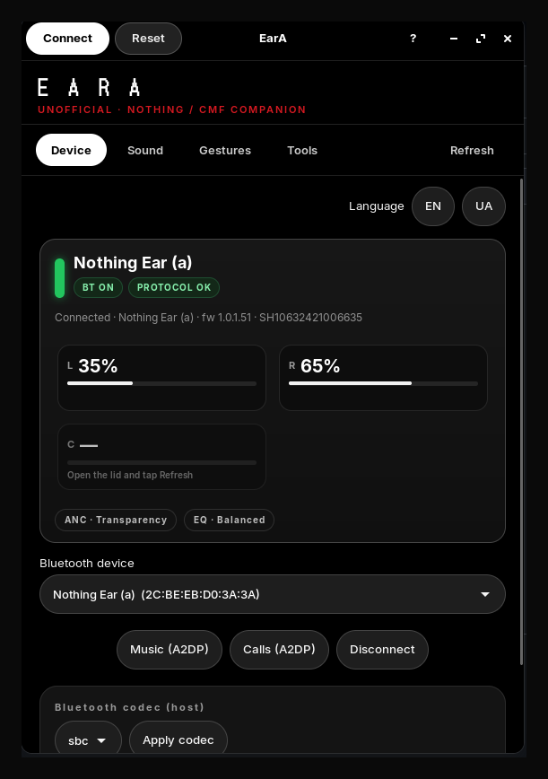
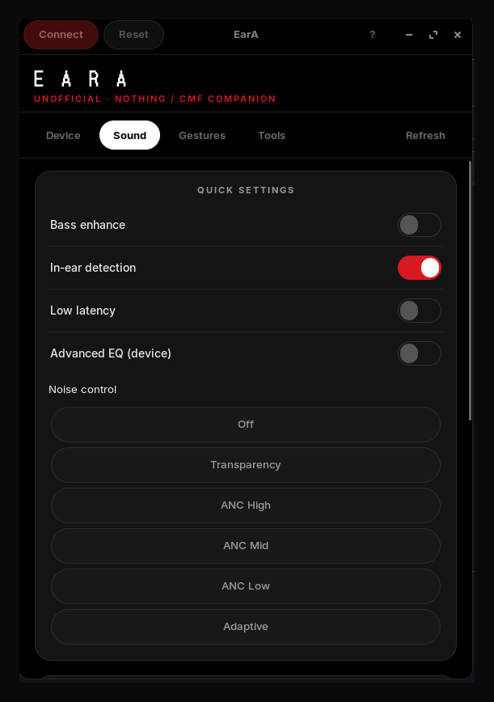

<div align="center">


**Unofficial GTK companion for Nothing / CMF earbuds on Linux**

BlueZ · PulseAudio / PipeWire · RFCOMM control · CLI + GUI

[](LICENSE)
[](https://oneydef.github.io/EarA-linux/)
[](https://github.com/oneydef/EarA-linux/releases)
[](https://www.python.org/)
[](https://gitlab.gnome.org/GNOME/libadwaita)

[Install](#install) · [Live demo](https://oneydef.github.io/EarA-linux/) · [Features](#features) · [CLI](#cli) · [Lineup](LINEUP.md) · [Support](#support) · [Contributing](CONTRIBUTING.md)

</div>

---

> Independent community project — **not** affiliated with Nothing Technology or CMF.

EarA brings battery, ANC, EQ, gestures, find-my, and Bluetooth audio routing to Linux desktops. Tested with **Nothing Ear (a)**; other Nothing / CMF models use the same protocol family ([LINEUP.md](LINEUP.md)).

**[Try the interactive demo →](https://oneydef.github.io/EarA-linux/)**

<p align="center">
  
  &nbsp;
  
</p>

## Features

| Audio | Device | Extras |
|-------|--------|--------|
| A2DP music & Discord | Battery L / R / case | Pinch remapping |
| Optional HFP mic (`eara audio hfp`) | ANC + transparency | Find my earbuds |
| Host codec list (LHDC if adapter supports) | EQ presets + 8-band UI | Ear-tip fit test |
| | Bass / latency / in-ear | |

## Install

### Quick (from source)

```bash
sudo apt install python3 python3-gi python3-dbus gir1.2-gtk-4.0 gir1.2-adw-1 bluez
git clone https://github.com/oneydef/EarA-linux.git
cd EarA-linux
./scripts/install-user.sh
eara gui
```

Adds `~/.local/bin/eara` and a **Nothing X; Nothing Ears** entry in the app menu.

### Packages

Download `.deb`, `.rpm`, or AppImage from [GitHub Releases](https://github.com/oneydef/EarA-linux/releases).

```bash
sudo dpkg -i eara_*_all.deb
eara gui
```

## CLI

```bash
eara status
eara connect
eara anc transparency
eara eq more_bass
eara graphic-eq 0 0 0 0 0 0 0 0
eara audio mic          # Discord — same A2DP as music
eara audio hfp          # bud microphone (lower quality)
eara ring both
eara doctor
```

## Dual connection

If Linux has no A2DP sink, disconnect Bluetooth on the phone so the PC can take audio.

## Support

EarA is free community software. If it saves you time on Linux:

**[Buy me a coffee](https://buymeacoffee.com/r18fon7sj9)**

## Protocol

RFCOMM ch. 15 · UUID `aeac4a03-dff5-498f-843a-34487cf133eb` · frames `55 60 01 | cmd | dir | len | seq | payload | CRC-16/ARC`.

## License

SPDX-License-Identifier: **GPL-3.0-or-later** · Copyright (C) 2026 [oneydef](https://github.com/oneydef)

See [LICENSE](LICENSE) and [NOTICE](NOTICE). Product names are trademarks of their owners — see [TRADEMARKS.md](TRADEMARKS.md).
